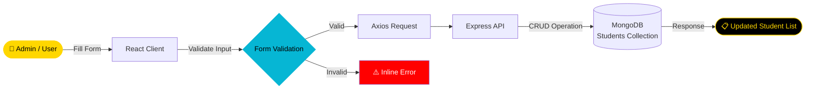

<div align="center">


[](https://git.io/typing-svg)

<br/>

<p align="center">
  <a href="https://github.com/NietoDeveloper">
    
  </a>
  <a href="https://committers.top/colombia#NietoDeveloper">
    
  </a>
  <a href="https://react.dev/">
    
  </a>
  <a href="https://nodejs.org/">
    
  </a>
  <a href="https://www.mongodb.com/">
    
  </a>
  <a href="https://opensource.org/licenses/MIT">
    
  </a>
</p>

<p align="center">
  <a href="https://github.com/NietoDeveloper/UsersInfoSystem">
    
  </a>
</p>

</div>

---

## 📋 Overview

A **Student Information Management System** — a web application designed to add, manage, and list student details efficiently. The project is built with modern web development technologies to provide a user-friendly interface and reliable functionality.

---

## 🗂️ Project Structure

```text
UsersInfoSystem/
├── back-end/          # Node.js + Express API, MongoDB integration
└── client/            # React frontend
    ├── public/
    └── src/
        └── components/  # Reusable UI components
```

---

## 🔄 Student Record Flow



---

## ✨ Features

- **Full CRUD Operations:** Add, view, update, and delete student details.
- **Interactive & Responsive UI:** Enhanced usability with Material-UI or Bootstrap.
- **Form Validation:** Built-in validation ensuring accurate data entry.

---

## 🛠️ Technologies Used

<div align="center">

| Layer | Technologies |
|:------|:-------------|
| 🎨 **Frontend** | React.js |
| ⚙️ **Backend** | Node.js, Express.js |
| 🗄️ **Database** | MongoDB |
| 💅 **Styling** | CSS |

</div>

---

## 🚀 Installation

**Step 1 — Clone the repository**

```bash
git clone https://github.com/NietoDeveloper/UsersInfoSystem
```

**Step 2 — Navigate to the project directory**

```bash
cd UsersInfoSystem
```

**Step 3 — Install dependencies**

**Frontend**

```bash
npx create-react-app my-app
cd my-app
npm install axios
```

**Backend**

```bash
# ~/Project_dir/
mkdir server
cd server
npm init -y
npm install express body-parser cors mongoose
```

**Step 4 — Configure environment variables**

Create a `.env` file in the `server` directory with your MongoDB connection string and other necessary variables.

**Step 5 — Run the application**

**Backend**

```bash
# ~/Project_dir/
cd server
node index.js
```

**Frontend**

```bash
# ~/Project_dir/
cd my-app
npm start
```

Open the application in your browser at `http://localhost:3000`.

---

## 👨‍💻 Author

**Manuel Nieto (NietoDeveloper)**
GitHub: [@NietoDeveloper](https://github.com/NietoDeveloper)

---

## 📄 License

This project is licensed under the **MIT License**.

<div align="center">

<br/>


</div>


sh
git clone https://github.com/NietoDeveloper/UsersInfoSystem
```

**Step 2 — Navigate to the project directory**

```bash
cd UsersInfoSystem
```

**Step 3 — Install dependencies**

**Frontend**

```bash
npx create-react-app my-app
cd my-app
npm install axios
```

**Backend**

```bash
# ~/Project_dir/
mkdir server
cd server
npm init -y
npm install express body-parser cors mongoose
```

**Step 4 — Configure environment variables**

Create a `.env` file in the `server` directory with your MongoDB connection string and other necessary variables.

**Step 5 — Run the application**

**Backend**

```bash
# ~/Project_dir/
cd server
node index.js
```

**Frontend**

```bash
# ~/Project_dir/
cd my-app
npm start
```

Open the application in your browser at `http://localhost:3000`.

---

## 👨‍💻 Author
